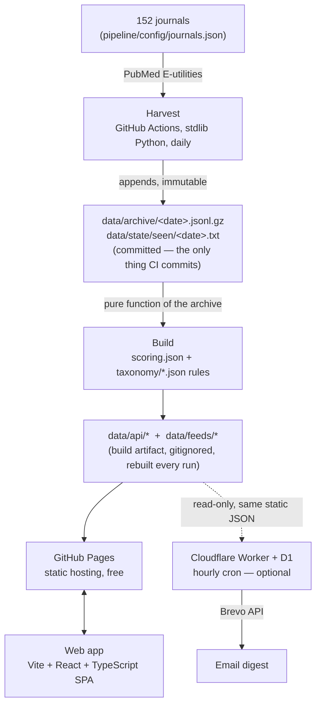

# Evidence Digest

A free, open-source tool that watches 152 medical journals on PubMed, sorts newly
indexed studies into topics you choose, and shows you what's new — on a website, as
RSS/Atom feeds, or (optionally) by email. No language model decides what you see;
every ranking and every topic assignment is a transparent, deterministic rule you
can read in this repository.

**Live site:** <https://muhammadali-k.github.io/evidence-digest/>
**Docs:** [evidence-digest-docs](https://github.com/muhammadali-k/evidence-digest-docs) — deployment, architecture, ranking, taxonomy, and operations, in full

## What it does for a reader

Pick the topics you care about — say, heart failure and CAR T-cell therapy — and
Evidence Digest shows you every newly indexed study in those topics, newest first,
with a plain-language one-line "why this matters" summary, an evidence-level badge
(guideline, meta-analysis, randomized trial, ...), and a link straight to PubMed.
No account is required to browse. An email address is only needed if you want a
daily/weekly/monthly digest instead of checking the site or an RSS feed yourself.

## Architecture



Full walkthrough, including why the archive is immutable gzipped JSONL and why the
read path is static files: [evidence-digest-docs/architecture.md](https://github.com/muhammadali-k/evidence-digest-docs/blob/main/architecture.md).

## Run it yourself

Five commands from a fresh clone:

```bash
git clone https://github.com/muhammadali-k/evidence-digest.git
cd evidence-digest
./scripts/first-run.sh          # validate config, backfill ~30 days, build the API
cd web && npm install && cd ..
./scripts/dev.sh                 # starts the web app (and the Worker, if configured)
```

Then open the printed local URL. For a real deployment on GitHub Pages (free, no
server to run), see the five-step path in
[evidence-digest-docs/deployment.md](https://github.com/muhammadali-k/evidence-digest-docs/blob/main/deployment.md).
To switch on email digests, run `./scripts/setup-cloudflare.sh` once you have a
free Cloudflare account and a free Brevo account.

## Chinese selected-journals feed (for fork owners)

This optional Atom feed provides Chinese summaries of eligible research articles
from the selected journals. Subscribe in Inoreader with this exact URL:

<https://Yy-glitch0238.github.io/evidence-digest-1/feeds/selected-journals-zh.xml>

Each card title is `【journal abbreviation】English article title`. Its Chinese
body has four sections — `研究目的`, `研究方法`, `主要结果`, and `结论` — followed by
the PubMed link.
Only selected-journal research articles with an abstract are included. News,
editorials, comments, letters, corrections, retractions, announcements, and
other non-research items are excluded.

### One-time setup

The Chinese summaries use Cloudflare Workers AI model
`@cf/qwen/qwen3-30b-a3b-fp8`. In your GitHub fork, add these two repository
secrets (use your own Cloudflare values; never put them in this README or a
commit):

- `CLOUDFLARE_ACCOUNT_ID`
- `CLOUDFLARE_AI_TOKEN`

In GitHub, open `Settings → Secrets and variables → Actions → New repository secret`
and add each name and its value. The normal Harvest schedule runs every Sunday at
23:00 Beijing time (Sunday 15:00 UTC). If the workflow reaches `main` before then,
the first scheduled run is 2026-08-09 at 23:00 Beijing time.

### Refreshing and recovery

To run it now, use `Actions → Harvest → Run workflow`; leave the lookback at the
normal value of 8 days. The first run may create fewer than 51 Chinese entries,
because non-research items and records without abstracts are removed.

If an AI request fails, that article is left out temporarily and is retried on a
later run. If either Cloudflare secret is missing, the workflow skips new Chinese
AI work without breaking the English feeds or Chinese entries already cached.
To roll back, simply resubscribe in Inoreader to the existing English feed:

<https://Yy-glitch0238.github.io/evidence-digest-1/feeds/selected-journals-all.xml>

## What it costs to run

| Piece | Cost |
|---|---|
| GitHub Pages hosting | Free |
| GitHub Actions (public repo) | Free, unlimited minutes |
| Cloudflare Workers + D1 (email, optional) | Free tier — plenty for a personal or small-community digest |
| Brevo (email delivery, optional) | Free tier — 300 emails/day |

There is no required paid component. The two optional API credentials
(`NCBI_API_KEY`, `PUBMED_EMAIL`) are also free — they just raise your PubMed rate
limit from 3 to 10 requests/second.

## Adding a journal or a topic

Both are pure config changes — no code:

- **Journal:** add an entry to [`pipeline/config/journals.json`](pipeline/config/journals.json)
  with its exact MEDLINE title abbreviation (PubMed's `[ta]` field — the only
  identifier that doesn't drift), then run `python -m evidence_digest.cli check`
  to confirm it resolves. Or open a
  [Journal request](../../issues/new?template=journal_request.yml) issue and
  someone will.
- **Topic:** add an entry to the right specialty file under
  [`pipeline/config/taxonomy/`](pipeline/config/taxonomy/) with its MeSH terms,
  phrases, and acronyms. **Topic slugs are permanent public identifiers** (URLs,
  feed filenames, stored subscriber preferences) — never rename one; add a new
  topic instead. Full guide:
  [evidence-digest-docs/taxonomy.md](https://github.com/muhammadali-k/evidence-digest-docs/blob/main/taxonomy.md).

## How ranking works — and it is not AI

Every study gets a 0–100 score from [`pipeline/config/scoring.json`](pipeline/config/scoring.json):
journal tier + evidence-design points (a guideline or RCT scores far higher than
a case report) + a recency bonus that decays over ~10 days + small bonuses for
signals like Phase 3, multicentre, or open access, minus penalties for corrections,
comments, or missing abstracts. Topic assignment is equally mechanical: a study
accumulates points from MeSH-term, title/keyword, and acronym matches against each
topic's rules in `taxonomy/*.json` and joins the topic once it crosses a threshold.
**No language model reads, ranks, or classifies anything here.** Every score is
reproducible from the config files in this repo and the study's own PubMed record.
See [evidence-digest-docs/ranking.md](https://github.com/muhammadali-k/evidence-digest-docs/blob/main/ranking.md)
for the exact formula and worked examples.

## Data source and attribution

Evidence Digest is built on PubMed® data from the U.S. National Library of
Medicine (NLM), National Institutes of Health. It is an independent, unofficial
project and is **not affiliated with, endorsed by, or sponsored by NLM, NIH, or
PubMed**. All studies link back to their canonical PubMed record. This tool is a
literature-alerting aid for professionals, not a substitute for reading the primary
literature or for clinical judgment.

## Contributing

See [CONTRIBUTING.md](CONTRIBUTING.md) — journal and topic proposals, how to run
the tests, and commit conventions. Please read [CODE_OF_CONDUCT.md](CODE_OF_CONDUCT.md)
too. Found a security issue? See [SECURITY.md](SECURITY.md) rather than opening a
public issue.

## License

MIT — see [LICENSE](LICENSE).
